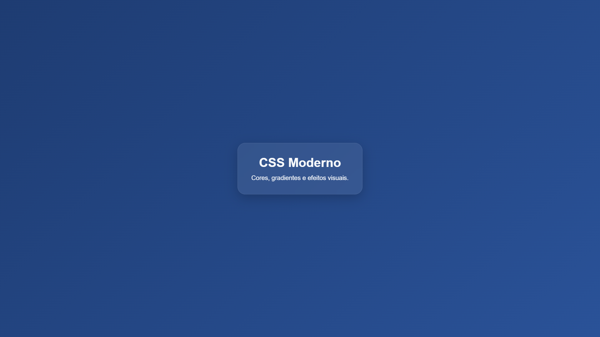

## Preview


# Cores, Gradientes e Efeitos Visuais no CSS

## CSS Moderno e Renderização Visual

O CSS moderno não atua apenas como estilização superficial. Hoje, ele participa diretamente de:
- **Experiência do usuário** ativa e fluida;
- **Hierarquia visual** bem definida;
- **Acessibilidade** digital nativa;
- **Percepção de qualidade** do produto;
- **Identidade visual** e consistência.

---

# 1. Formatos de Cores Modernos

- **HEX / RGB**
- **HSL**
- **OKLCH**

HEX utiliza representação hexadecimal e RGB representa intensidade luminosa.

HSL organiza a cor em um modelo cilíndrico através de **Matiz** (ângulo), **Saturação** (%) e **Luminosidade** (%).

OKLCH é um espaço de cor perceptualmente uniforme. Mudanças numéricas geram alterações visuais consistentes e previsíveis.

```css
:root {
  --surface: #111827;
  --accent: hsl(210 80% 60%);
  --modern: oklch(62% 0.22 260);
}

body {
  background: var(--surface);
  color: white;
}
```

---

# 2. Gradientes Lineares

- **linear-gradient**
- **color-stops**
- **Interpolação matemática**

Gradientes são tratados pelo navegador como imagens procedurais geradas dinamicamente.

O motor do navegador realiza a interpolação matemática diretamente entre os pixels.

Os color-stops controlam com precisão a posição e a distribuição das cores ao longo do eixo angular.

```css
body {
  min-height: 100vh;
  background: linear-gradient(
    135deg,
    #1e3c72 0%,
    #2a5298 50%,
    #4facfe 100%
  );
}
```

---

# 3. Gradientes Radiais e Cônicos

- **radial-gradient**
- **conic-gradient**
- **Profundidade e Dados**

Gradientes radiais expandem cores para fora a partir de um ponto central geométrico.

Gradientes cônicos distribuem cores de forma rotacional e angular (como ponteiros de um relógio).

Muito utilizados para iluminação de interfaces, componentes de dashboard e gráficos de pizza nativos.

```css
.card {
  background: radial-gradient(
    circle at top,
    rgba(255, 255, 255, 0.3),
    rgba(15, 23, 42, 1)
  );
}

.chart {
  background: conic-gradient(
    #22c55e 0deg,
    #3b82f6 180deg,
    #ef4444 360deg
  );
}
```

---

# 4. Sombras e Profundidade

- **box-shadow**
- **drop-shadow()**
- **Máscara alfa**

Sombras adicionam volume, profundidade tridimensional e hierarquia na interface.

O `box-shadow` obedece estritamente às bordas rígidas do Box Model (caixa retangular).

O `filter: drop-shadow()` ignora o quadrado do elemento e considera a máscara alfa (transparência real dos pixels).

```css
.card {
  box-shadow: 0 10px 30px rgba(0, 0, 0, 0.25);
}

.logo {
  filter: drop-shadow(0 0 12px rgba(59, 130, 246, 0.7));
}
```

---

# 5. Opacidade e Filtros Visuais

- **opacity**
- **filter**
- **backdrop-filter**

A propriedade `opacity` altera a transparência global do elemento e afeta todos os seus filhos.

O `filter` aplica pós-processamento visual (como blur e brightness) diretamente no elemento renderizado através da GPU.

O `backdrop-filter` processa graficamente apenas a área que está localizada atrás do elemento (efeito de vidro fosco).

```css
.modal {
  opacity: 0.8;
}

.image {
  filter: brightness(1.2);
}

.glass {
  backdrop-filter: blur(12px);
}
```

---

# 6. Boas Práticas e Acessibilidade

- **Diretrizes WCAG**
- **Contraste mínimo**
- **Custo de Repaint (Performance)**

Interfaces modernas e profissionais precisam garantir legibilidade estável e alto contraste.

O excesso de filtros gráficos pesados (como grandes blurs) aumenta o custo de repaint e sobrecarrega o hardware.

```css
body {
  background: #111827;
  color: #f9fafb;
}

button {
  background: #2563eb;
  color: white;
}
```

---

# Conclusão

O CSS moderno combina renderização visual sofisticada, acessibilidade, performance e design systems estruturados.

Esses recursos nativos permitem construir interfaces ricas sem depender de imagens externas pesadas, otimizando o carregamento e a experiência do usuário.
